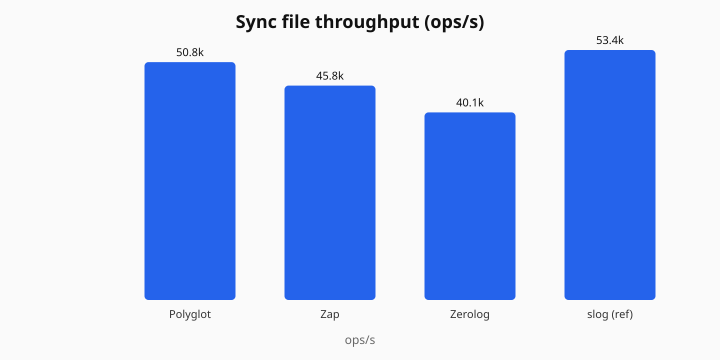
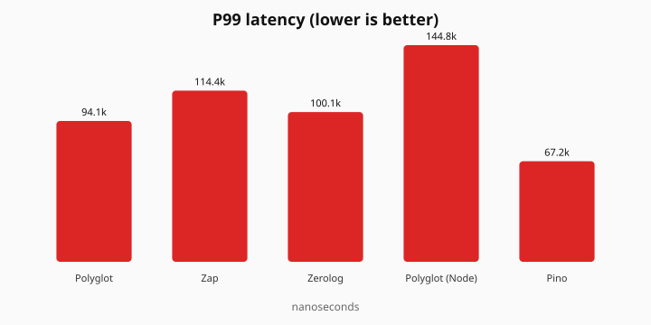
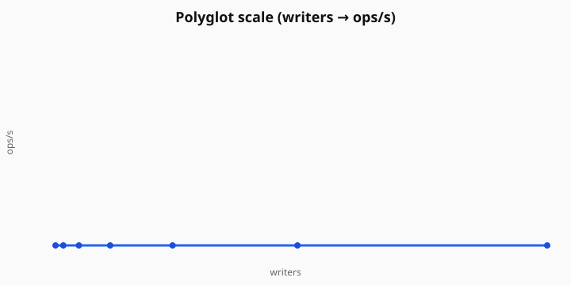
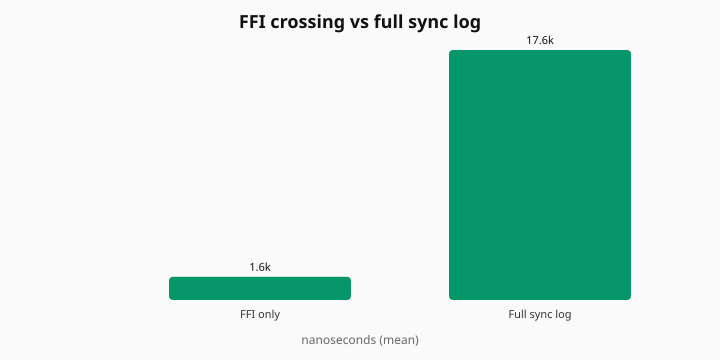

# Polyglot

A shared logging core written in Go, with thin bindings for Node, Python, and .NET. Same `polyglot.yaml`, same JSON shape, same sinks — whether you're in one language or four.

## Install

```bash
npm install @polyglot-logger/node
pip install polyglot-logger
dotnet add package Polyglot.Logger
```

No Go/CGO required. Native binaries ship inside the packages (Linux, Windows, macOS arm64).

## Quick example

```js
import { Logger } from "@polyglot-logger/node";

const log = new Logger({ service: "api", stdout: true });
log.info("hello", { user_id: 1 });
log.close();
```

```python
from polyglot_logger import Logger

with Logger("api", stdout=True) as log:
    log.info("hello", user_id=1)
```

```csharp
using Polyglot.Logger;

using var log = new Logger(new LoggerOptions { Service = "api", Stdout = true });
log.Info("hello", new() { ["user_id"] = 1 });
```

Or drop a config file next to your app:

```yaml
# polyglot.yaml
service: api
level: info
stdout: true
```

See [first log](docs/first-log.md) for a full walkthrough.

## Why use it?

If you only write Go, use Zap. If you only write Node, use Pino. Polyglot is for stacks that mix languages and want one ops model — shared config, Loki/HTTP shipping, async queue, overflow policy, hot reload — without reimplementing that three times.

## Benchmarks

On a Windows laptop (i7-1355U), Go sync file throughput is in the same ballpark as Zap (~50k vs ~46k ops/s in the last local run). Node async sits behind Pino; FFI crossing is about 1.6 µs and is not the bottleneck.









Methodology and how to regenerate: [bench/README.md](bench/README.md).

```bash
make build-native && make bench
```

## Documentation

- [First log](docs/first-log.md)
- [User guide](docs/user-guide.md)
- [Configuration](docs/configuration.md)
- [Sinks & Loki](docs/sinks.md)
- [Compatibility](docs/compatibility.md)
- [Migrate from Pino](docs/migrate-from-pino.md) · [Zap](docs/migrate-from-zap.md) · [Serilog](docs/migrate-from-serilog.md) · [Python logging](docs/migrate-from-python-logging.md)
- Full index: [docs/](docs/README.md)

## Supported languages

| Language | Package |
| --- | --- |
| Node.js | [@polyglot-logger/node](https://www.npmjs.com/package/@polyglot-logger/node) |
| Python | [polyglot-logger](https://pypi.org/project/polyglot-logger/) |
| .NET | [Polyglot.Logger](https://www.nuget.org/packages/Polyglot.Logger) |
| Go | `polyglot/internal/logger` (in-repo; no shared lib required) |

## Contributing

```bash
git clone --recurse-submodules https://github.com/kishankumarhs/Polyglot.git
cd Polyglot
bash scripts/check-submodules.sh
make build-native
go test ./internal/logger ./native -count=1
```

Details: [CONTRIBUTING.md](CONTRIBUTING.md) · [getting started](docs/getting-started.md)

## License

MIT
