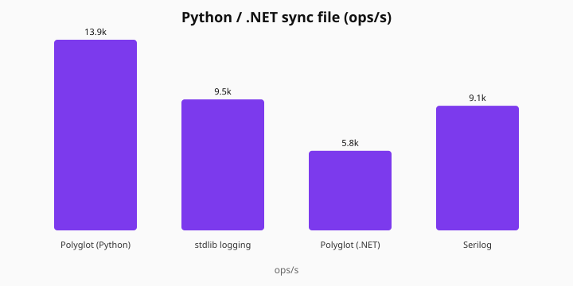

# Polyglot

**Polyglot is a production logging platform that brings one logging engine, one configuration model, and one operational experience to Node.js, Python, .NET, and Go.**

Same `polyglot.yaml`, same sinks, same async queue / overflow / sampling / hot reload — whether you run one language or four.

## Install

Current publish line is **0.3.x** (not 1.0). Check the registry for the latest patch (`npm view @polyglot-logger/node version`, PyPI, NuGet).

```bash
npm install @polyglot-logger/node
# or: npm install @polyglot-logger/node@^0.3.0
pip install polyglot-logger
dotnet add package Polyglot.Logger
```

No Go/CGO required. Native binaries ship inside the packages (Linux, Windows, macOS arm64).

## Quick example

```js
import { Logger } from "@polyglot-logger/node";

const log = new Logger({ service: "api", stdout: true });
log.info("hello", { user_id: 1 });
log.close();
```

```python
from polyglot_logger import Logger

with Logger("api", stdout=True) as log:
    log.info("hello", user_id=1)
```

```csharp
using Polyglot.Logger;

using var log = new Logger(new LoggerOptions { Service = "api", Stdout = true });
log.Info("hello", new() { ["user_id"] = 1 });
```

Or drop `polyglot.yaml` at the git repo root (discovered from any app cwd):

```yaml
# polyglot.yaml
service: api
level: info
stdout: true
```

Side-by-side APIs: [sdk.md](docs/sdk.md) · First log: [first-log.md](docs/first-log.md) · Stuck? `go run ./cmd/polyglot doctor`

## Why use it?

If you only write Go, use Zap. If you only write Node, use Pino. Polyglot is not trying to win a single-language speed contest — it standardizes logging across polyglot stacks so platform teams do not normalize four different configs, field names, sinks, and overflow behaviors.

One shared engine means identical:

- sinks (stdout, rotating file, HTTP, Loki)
- reload, queue, overflow, and sampling
- JSON schema and lifecycle (`flush` / `close`)

across Node, Python, .NET, and Go.

## Benchmarks

On a Windows laptop (i7-1355U), Go sync file throughput is in the same ballpark as Zap (~50k vs ~46k ops/s in the last local run). Node async sits behind Pino; FFI crossing is about 1.6 µs and is not the bottleneck.




Methodology and how to regenerate: [bench/README.md](bench/README.md).

```bash
make build-native && make bench
```

## Documentation

- [SDK comparison](docs/sdk.md)
- [First log](docs/first-log.md)
- [Zero-config](docs/zero-config.md) · [Monorepo](docs/monorepo.md)
- [User guide](docs/user-guide.md)
- [Configuration](docs/configuration.md)
- [Sinks & Loki](docs/sinks.md)
- [Compatibility](docs/compatibility.md) · [Compatibility guarantees](docs/compatibility-policy.md)
- [Migrate from Pino](docs/migrate-from-pino.md) · [Zap](docs/migrate-from-zap.md) · [Serilog](docs/migrate-from-serilog.md) · [Python logging](docs/migrate-from-python-logging.md)
- Full index: [docs/](docs/README.md)

## Supported languages

| Language | Package |
| --- | --- |
| Node.js | [@polyglot-logger/node](https://www.npmjs.com/package/@polyglot-logger/node) |
| Python | [polyglot-logger](https://pypi.org/project/polyglot-logger/) |
| .NET | [Polyglot.Logger](https://www.nuget.org/packages/Polyglot.Logger) |
| Go | `polyglot/internal/logger` (in-repo; no shared lib required) |

## Contributing

```bash
git clone --recurse-submodules https://github.com/kishankumarhs/Polyglot.git
cd Polyglot
bash scripts/check-submodules.sh
make build-native
go test ./internal/logger ./native -count=1
```

Details: [CONTRIBUTING.md](CONTRIBUTING.md) · [getting started](docs/getting-started.md)

## License

MIT
