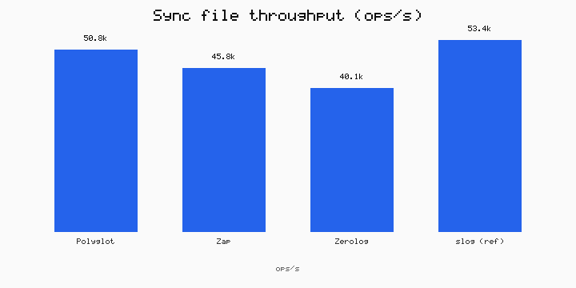
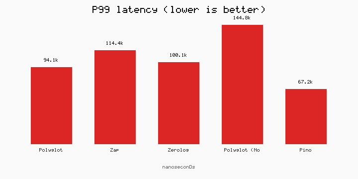
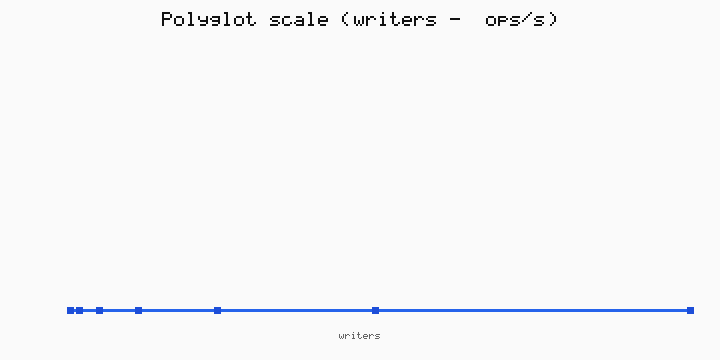
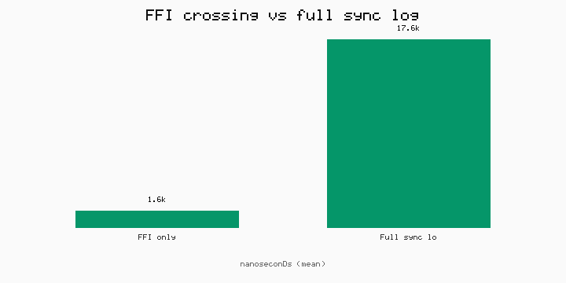

# Benchmarks

Compare Polyglot to Zap, Zerolog, and Pino. Also cover overflow, hot reload, FFI cost, and cross-language schema.

Every timed path reports mean / P50 / P95 / P99, not just ops/sec.

If you only ship one language, that language's best logger still wins on ergonomics. Polyglot's pitch is a shared runtime across languages — these benches check that the cost is acceptable.

## Run

```bash
make build-native
make bench              # full suite → results/latest.md + charts
make bench-smoke        # short CI run
make bench-pprof        # cpu/heap profiles
python scripts/bench-charts.py   # charts from summary.json only
```

## Charts

Numbers come from `make bench` into [`results/summary.json`](results/summary.json). Until you regenerate, charts may be a previous snapshot.









## What we measure

### Go (`bench/go`)

- Sync / async file vs Zap and Zerolog (slog is a reference row)
- Rich ~20-field payload
- `With()` child vs `zap.With` / `zerolog.With`
- Scale 1→64 writers
- Memory / GC for a fixed N

### Node / Bun (`bench/node`)

- Polyglot sync + async file vs Pino sync file
- Same script on Bun when `bun` is on `PATH`

### FFI (`ffi_baseline.mjs`)

Splits native crossing (`logger_version`) from a full sync log. Crossing is cheap; serialize + disk dominate.

### Cross-language (`bench/cross`)

Go / Node / Python / .NET write the same schema through the same native lib.

### Overflow & reload

Ops behavior, not micro-ops/sec:

- Queue overflow (`TestOverflowBackpressure`) — flood a small queue, report dropped / flushed / recover time
- Hot reload (`TestHotReloadUnderLoad`) — `ReloadConfig` under load

## Fairness

- Same rich field shape across competitors
- Sync file is the fair comparison; async Polyglot is labeled separately
- Child scopes use `With()` — not racing global `SetFields`

## History

[HISTORY.md](HISTORY.md) — version rows from CI. Absolute numbers vary by machine; compare relative deltas on the same runner.
